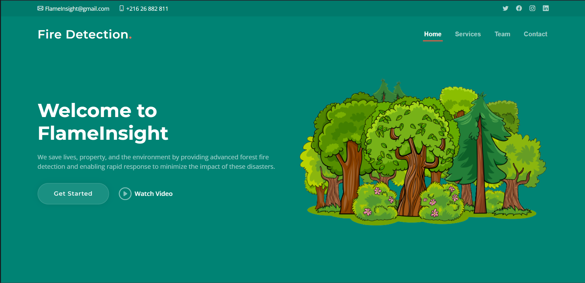
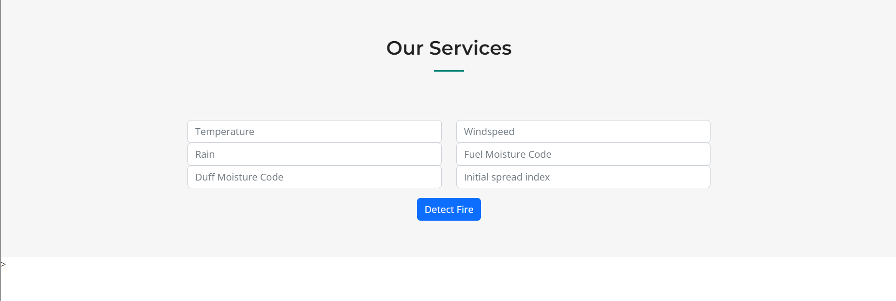
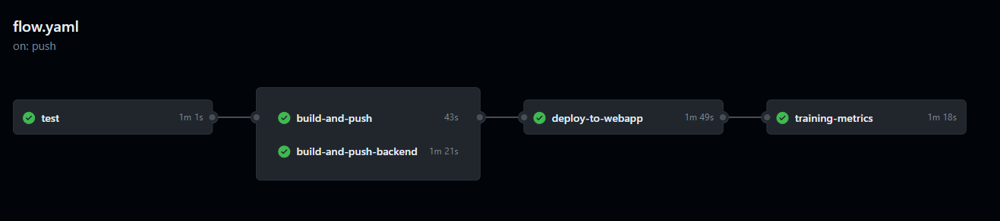
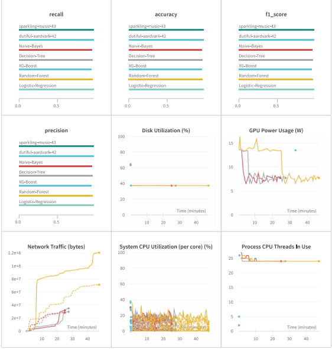

# Forest Fires Detection App
This project is a Forest Fires Detection application that consists of a native web frontend and a backend built with FastAPI. The application is hosted on Azure and utilizes monitoring with W&B (Weights & Biases) and automation with GitHub Actions. The project includes two web apps, one for the frontend and one for the backend, which are connected to each other. The testing of the application is done using pytest. The following is an overview of the workflow to provide an understanding of the project structure and processes.

## Web Interface
The Forest Fires Detection App offers a user-friendly interface that allows users to easily interact with the application. The frontend web interface provides a visually appealing and intuitive design, enabling users to input relevant information and receive real-time updates on forest fire detection. Users can input data to assess the risk of forest fires. 

In a real-world scenario, the Forest Fires Detection App can be enhanced by integrating sensors deployed in the forest that periodically send information to the application. These sensors can be strategically placed to gather data on various environmental factors such as temperature, humidity, wind speed, and smoke density. The collected data from these sensors can then be transmitted to the application, providing real-time updates and a comprehensive understanding of the forest conditions.

## Workflow Overview
The workflow for the Forest Fires Detection App includes several steps and jobs:

### 1. Test Job
The "test" job is responsible for testing the application. It runs on an Ubuntu environment and performs the following steps:

Checks out the repository
Sets up the Python environment
Installs the dependencies listed in the requirements.txt file
Installs Pytest and other necessary packages
Runs the test cases using Pytest

### 2. Build and Push Job
The "build-and-push" job is triggered after the "test" job is completed successfully. It performs the following steps:

Checks out the repository
Logs in to the Azure Container Registry (ACR) for the frontend
Builds the Docker image for the frontend using the Dockerfile in the front directory
Pushes the Docker image to the ACR backend

### 3. Build and Push Backend Job
The "build-and-push-backend" job is triggered after the "test" job is completed successfully. It performs the following steps:

Checks out the repository
Logs in to the Azure Container Registry (ACR) for the backend
Builds the Docker image for the backend using the Dockerfile in the FastAPI_backend directory
Pushes the Docker image to the ACR backend

### 4. Deploy to Web App Job
The "deploy-to-webapp" job is triggered after both the "build-and-push" and "build-and-push-backend" jobs are completed successfully. It performs the following steps:

Checks out the repository
Logs in to Azure
Deploys the Docker image of the frontend to the Azure Web App specified by the WEBAPP_NAME
Deploys the Docker image of the backend to the Azure Web App specified by the BACKEND_WEBAPP_NAME

### 5. Training Metrics Job
The "training-metrics" job is triggered after the "deploy-to-webapp" job is completed successfully. It performs the following steps:

Checks out the repository
Sets up the Python environment
Installs the dependencies listed in the requirements.txt file
Runs the training script, utilizing the W&B API key from secrets

  

### The Forest Fires Detection App is configured with the following environment variables:

REGISTRY_NAME: Name of the frontend Azure Container Registry (ACR)

REGISTRY_BACKEND_NAME: Name of the backend Azure Container Registry (ACR)

IMAGE_NAME: Name of the frontend Docker image

BACKEND_IMAGE_NAME: Name of the backend Docker image

WEBAPP_NAME: Name of the Azure Web App for the frontend

BACKEND_WEBAPP_NAME: Name of the Azure Web App for the backend

RESOURCE_GROUP: Azure resource group name

LOCATION: Azure region location

The necessary secrets, such as ACR_USERNAME, ACR_PASSWORD, AZURE_CREDENTIALS, AZURE_WEBAPP_PUBLISH_PROFILE, AZURE_BACKEND_WEBAPP_PUBLISH_PROFILE, and WB_API_KEY are required and should be set in the GitHub repository.

This project aims to detect forest fires and provides a complete workflow to ensure the application is thoroughly
